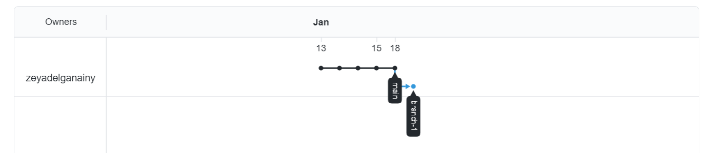

# Practice on branching & pull requests

This is some text that will be in the main original file and later on I will more to it.

This is an addition to the main branch and will be made in a new branch named **branch-1**.

## This is what the project branches look like at this moment:

